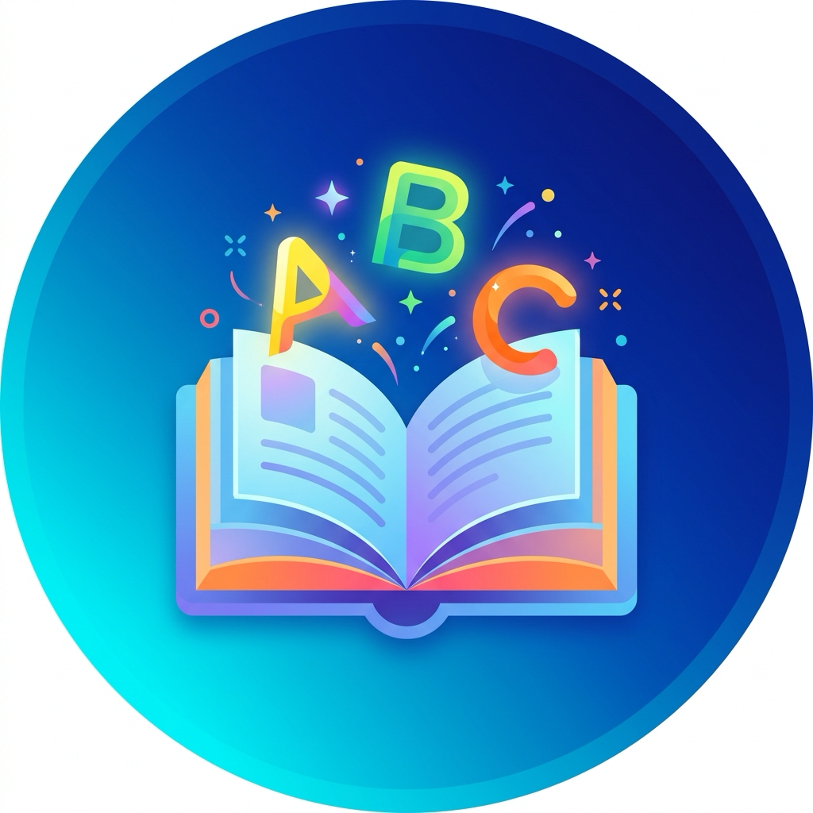
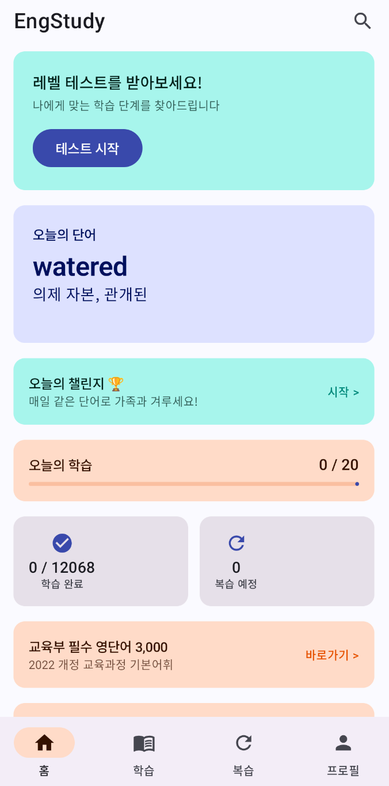

# EngStudy - 영어 단어장

<p align="center">
  
</p>

한국어 사용자를 위한 오프라인 영어 단어장 Android 앱입니다.

## 스크린샷



## 주요 기능

### 콘텐츠 (총 21,268개)
- **일반 단어 12,068개**: kengdic MPL 2.0 + Free Dictionary API
- **교육부 필수 영단어 3,000개**: 초등 800개, 중고등 1,800개, 전문 400개
- **숙어 & 구동사 1,092개**: MIT 라이선스 데이터셋
- **문법 예문 5,108개**: Tatoeba CC BY 2.0 FR

### 학습 모드
- **Stage 1-6 단계별 학습**: wordfreq 빈도 기반 분류 (Stage 1 = 최고빈도)
- **플래시카드**: 카드 뒤집기 방식 학습
- **4지선다 퀴즈**: 영→한, 한→영 교차 출제
- **스펠링 퀴즈**: 한국어 뜻 보고 영어 철자 입력
- **SM-2 간격반복** 복습 시스템 (interval >= 21일 = 학습 완료)
- **일일 챌린지**: 날짜 시드 기반으로 모든 기기에서 동일한 10개 단어 출제 → 가족 점수 경쟁 가능
- **배치 테스트**: 초기 레벨 평가로 학습 시작 단계 자동 추천

### 교육부 단어 전용
- **교육부 홈**: EduLevel(초등/중고/전문) 진행 카드
- **교육부 플래시카드 & 퀴즈** 별도 제공

### 숙어 & 문법
- **숙어/구동사 목록 & 퀴즈**
- **문법 예문 목록** (난이도 초급/중급/고급 필터링)

### 게임화 & 동기부여
- **콤보 시스템**: 3/5/10 연속 정답 시 단계별 애니메이션
- **레벨업 이펙트**: Stage 완료 시 confetti 파티클 축하 오버레이
- **12종 배지** + 연속 학습 스트릭(streak) 추적
- **학습 이력 캘린더**: GitHub contribution 스타일

### 편의 기능
- **오답 노트**: 퀴즈 오답 자동 수집 및 재학습
- **"이미 알아요" 마킹**: 단어/교육부 단어/숙어 개별 건너뛰기 (단어 목록에서 다중 선택 지원)
- **단어 완전 제외 & 복원**: 단어를 학습 전 영역에서 완전히 제외하고, 프로필에서 복원 가능
- **TTS 발음**: Android 내장 TextToSpeech
- **북마크**: 즐겨찾기 + 내보내기/공유
- **검색**: 영어/한국어 양방향 (300ms debounce)
- **학습 리포트 공유**: 통계를 카카오톡 등으로 공유
- **홈 위젯**: 오늘의 단어 홈 화면 위젯
- **다크모드**: 시스템/라이트/다크 3가지 선택
- **일일 학습 목표** 설정
- **학습 리마인더 알림**

## 기술 스택

| 항목 | 선택 |
|------|------|
| 언어 | Kotlin 2.1 |
| UI | Jetpack Compose + Material 3 |
| 아키텍처 | MVVM + Clean Architecture |
| DB | Room v9 (pre-populated SQLite) |
| DI | Hilt |
| Navigation | Compose Navigation (type-safe routes) |
| 비동기 | Coroutines + Flow |
| TTS | Android 내장 TextToSpeech |
| 설정 | DataStore Preferences |
| Min SDK | 26 / Target SDK 35 |

## 빌드

```bash
# 필요: Android Studio, JDK 17+
./gradlew assembleDebug
```

## 테스트

```bash
./gradlew testDebugUnitTest
# 리포트: app/build/reports/tests/testDebugUnitTest/index.html
```

## 단어 데이터 생성

kengdic(MPL 2.0) + Free Dictionary API + Tatoeba(CC BY 2.0 FR)를 기반으로 DB를 생성합니다.

```bash
pip install wordfreq nltk anthropic   # Python 의존성 설치
python3 -c "import nltk; nltk.download('wordnet')"

python3 scripts/generate_word_db.py   # 기본 단어 DB 생성
python3 scripts/build_meanings.py     # 다중 의미 생성 (WordNet 빈도 기반)
python3 scripts/build_examples.py     # Tatoeba 예문 매칭 (LLM 0토큰)

# (선택) 미커버 단어 예문 LLM 보완 — Anthropic API 키 필요, 약 $0.15
# export ANTHROPIC_API_KEY=sk-ant-...
# python3 scripts/build_examples_llm.py
```

생성된 `engstudy.db`를 `app/src/main/assets/databases/`에 배치합니다.

## 프로젝트 구조

```
app/src/main/java/com/wcjung/engstudy/
├── data/           # Room DB (10개 테이블, v9), Repository 구현, DataStore
├── domain/         # 도메인 모델, Repository 인터페이스, UseCase (SM-2 등)
├── ui/             # Compose UI (26개 화면, 네비게이션, 테마)
├── util/           # TTS, 알림, 홈 위젯
└── di/             # Hilt DI 모듈
scripts/
├── build_word_db.py        # 메인 DB 빌드 스크립트 (kengdic)
├── batch_utils.py          # 배치 공통 유틸
└── batch1_high_freq.py ~ batch10_broad.py  # Stage별 단어 배치
```

## 데이터 라이선스

| 데이터 | 라이선스 | 상업적 이용 |
|--------|---------|-----------|
| kengdic | MPL 2.0 | 가능 |
| Free Dictionary API | Free | 가능 |
| Tatoeba | CC BY 2.0 FR | 가능 (저작자 표시 필요) |
| 교육부 공공데이터 | 정부 공공저작물 | 가능 |
| phrasal-verbs (Semigradsky) | MIT | 가능 |
| wordfreq | MIT | 가능 |

## 라이선스

Private project.
