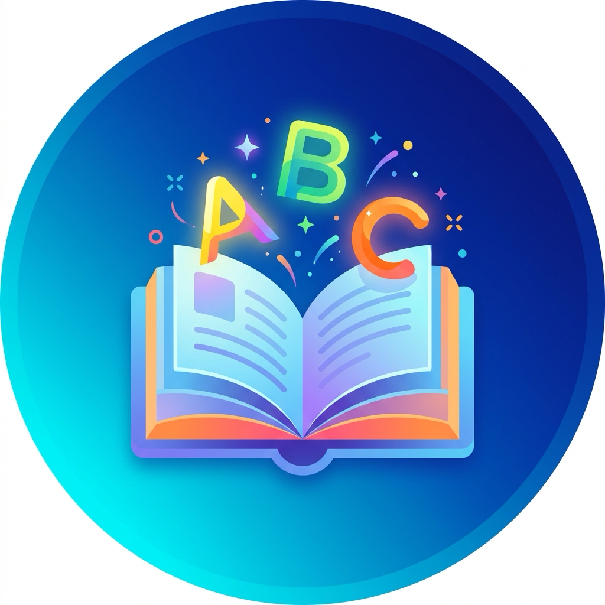
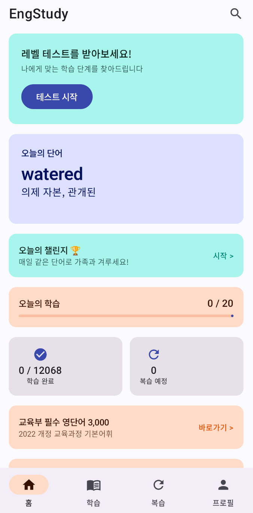

# EngStudy - 영어 단어장

<p align="center">
  
</p>

한국어 사용자를 위한 오프라인 영어 단어장 Android 앱입니다.

## 스크린샷



## 주요 기능

### 콘텐츠 (총 21,268개)
- **일반 단어 12,068개**: kengdic MPL 2.0 + Free Dictionary API
- **교육부 필수 영단어 3,000개**: 초등 800개, 중고등 1,800개, 전문 400개
- **숙어 & 구동사 1,092개**: MIT 라이선스 데이터셋
- **문법 예문 5,108개**: Tatoeba CC BY 2.0 FR

### 학습 모드
- **Stage 1-6 단계별 학습**: wordfreq 빈도 기반 분류 (Stage 1 = 최고빈도)
- **플래시카드**: 카드 뒤집기 방식 학습
- **4지선다 퀴즈**: 영→한, 한→영 교차 출제
- **듣기 퀴즈**: TTS 발음만 듣고 뜻(또는 단어)을 고르는 모드
- **스펠링 퀴즈**: 한국어 뜻 보고 영어 철자 입력
- **SM-2 간격반복** 복습 시스템 (interval >= 21일 = 학습 완료)
- **일일 챌린지**: 날짜 시드 기반으로 모든 기기에서 동일한 10개 단어 출제 → 가족 점수 경쟁 가능
- **배치 테스트**: 초기 레벨 평가로 학습 시작 단계 자동 추천

### 교육부 단어 전용
- **교육부 홈**: EduLevel(초등/중고/전문) 진행 카드
- **교육부 플래시카드 & 퀴즈 & 스펠링 & 듣기 퀴즈** 별도 제공
- **북마크·검색 탭·완전 제외/복원**: 기본 단어장과 동등한 부가 기능 (독립 테이블)
- **SM-2 복습 통합**: 교육부 퀴즈 응답도 동일 단어의 학습 진도로 기록

### 숙어 & 문법
- **숙어/구동사 목록 & 퀴즈**
- **문법 예문 목록** (난이도 초급/중급/고급 필터링)

### 게임화 & 동기부여
- **콤보 시스템**: 3/5/10 연속 정답 시 단계별 애니메이션
- **레벨업 이펙트**: Stage 완료 시 confetti 파티클 축하 오버레이
- **12종 배지** + 연속 학습 스트릭(streak) 추적
- **학습 이력 캘린더**: GitHub contribution 스타일

### 편의 기능
- **사용자 단어 추가**: 단어 목록 "+" 또는 검색 결과 없음에서 나만의 단어 등록 —
  목록·검색·퀴즈·복습에 자동 통합, 단어 상세에서 삭제 가능
- **단어 의미 추가/변경**: 대표 뜻 수정("기본값으로 되돌리기" 지원) + "내 의미" 추가
- **오답 노트**: 퀴즈 오답 자동 수집 및 재도전 퀴즈
- **"이미 알아요" 마킹**: 단어/교육부 단어/숙어 개별 건너뛰기 (단어 목록에서 다중 선택 지원)
- **단어 완전 제외 & 복원**: 단어를 학습 전 영역에서 완전히 제외하고, 프로필에서 복원 가능
- **학습 데이터 백업/복원**: 학습 진도·북마크·오답·내 단어·설정을 JSON 파일로 내보내기/가져오기
- **TTS 발음**: Android 내장 TextToSpeech
- **북마크**: 즐겨찾기 + 내보내기/공유
- **검색**: 영어/한국어 양방향 (300ms debounce)
- **학습 리포트 공유**: 통계를 카카오톡 등으로 공유
- **홈 위젯**: 오늘의 단어 홈 화면 위젯
- **다크모드**: 시스템/라이트/다크 3가지 선택
- **일일 학습 목표** 설정
- **학습 리마인더 알림**
- **데이터 출처 및 라이선스 화면**: Tatoeba 저작자 표시(CC BY 2.0 FR) 등 출처 표기

## 기술 스택

| 항목 | 선택 |
|------|------|
| 언어 | Kotlin 2.1 |
| UI | Jetpack Compose + Material 3 |
| 아키텍처 | MVVM + Clean Architecture |
| DB | Room v12 (pre-populated SQLite, 명시적 마이그레이션으로 사용자 데이터 보존) |
| DI | Hilt |
| Navigation | Compose Navigation (type-safe routes) |
| 비동기 | Coroutines + Flow |
| TTS | Android 내장 TextToSpeech |
| 설정 | DataStore Preferences |
| Min SDK | 26 / Target SDK 35 |

## 빌드

```bash
# 필요: Android Studio, JDK 17+
./gradlew assembleDebug
```

## 테스트

```bash
./gradlew testDebugUnitTest
# 리포트: app/build/reports/tests/testDebugUnitTest/index.html
```

## 단어 데이터 생성

kengdic(MPL 2.0) + Free Dictionary API + Tatoeba(CC BY 2.0 FR)를 기반으로 DB를 생성합니다.

```bash
pip install wordfreq nltk               # Python 의존성 설치
python3 -c "import nltk; nltk.download('wordnet')"

# 대표 뜻 파이프라인 (순서 중요)
python3 scripts/build_word_db.py        # 기본 단어 DB 생성 (kengdic + wordfreq + 교육부 xls)
python3 scripts/build_meanings.py       # 다중 의미 생성 (WordNet 빈도 기반)
python3 scripts/apply_edu_meanings.py   # 교육부 겹침 단어에 검수 뜻 적용
python3 scripts/build_meanings_llm.py   # 나머지 단어 뜻을 로컬 LLM(Ollama)으로 재생성

# 예문
python3 scripts/build_examples.py         # Tatoeba 예문 매칭 (LLM 0토큰)
python3 scripts/build_examples_ollama.py  # 미커버 단어 예문을 로컬 LLM(Ollama)으로 생성
```

생성된 `engstudy.db`를 `app/src/main/assets/databases/`에 배치합니다.
LLM 단계는 로컬 Ollama를 사용하므로 API 비용이 들지 않습니다
(Claude Batch API 버전은 `scripts/build_examples_llm.py`).

## 프로젝트 구조

```
app/src/main/java/com/wcjung/engstudy/
├── data/           # Room DB (13개 테이블, v12), Repository 구현, DataStore, 백업
├── domain/         # 도메인 모델, Repository 인터페이스, UseCase (SM-2 등)
├── ui/             # Compose UI (28개 화면, 네비게이션, 테마)
├── util/           # TTS, 알림, 홈 위젯
└── di/             # Hilt DI 모듈
scripts/
├── build_word_db.py          # 메인 DB 빌드 스크립트 (kengdic + wordfreq + 교육부 xls)
├── build_meanings.py         # 다중 의미 생성 (WordNet 빈도 기반)
├── apply_edu_meanings.py     # 교육부 검수 뜻 적용
├── build_meanings_llm.py     # 대표 뜻 LLM 재생성 (로컬 Ollama)
├── build_examples.py         # Tatoeba 예문 매칭
├── build_examples_ollama.py  # 예문 LLM 보완 (로컬 Ollama)
└── archive/                  # 과거 일회성 스크립트
```

## 데이터 라이선스

| 데이터 | 라이선스 | 상업적 이용 |
|--------|---------|-----------|
| kengdic | MPL 2.0 | 가능 |
| Free Dictionary API | Free | 가능 |
| Tatoeba | CC BY 2.0 FR | 가능 (저작자 표시 필요) |
| 교육부 공공데이터 | 정부 공공저작물 | 가능 |
| phrasal-verbs (Semigradsky) | MIT | 가능 |
| wordfreq | MIT | 가능 |

## 라이선스

Private project.
